# RFC 4

- Title: 層
- Tag: None
- Class: Standard
- Related: None
- DateTime: 2021-08-28

---

## 層

本言語は、それぞれの役割を分類し、明確化するための層をいくつか持っています。

- 語用層
  - 発話と文脈の関係を定める
- 意味層
  - 意味を定める
- 構文層
  - 文法を定める
- 語形層
  - 語形を定める
- 語彙層
  - 語根の作り方を定める
  - 語根や合成語を定める
- 借用層
  - 借用語の作り方を定める
- 音素配列層
  - 音素の並べ方を定める
- 借用音素層
  - 言語にない音素を言語にある音素に変換する
- 文字層
  - 言語の音素と文字の対応させる
- 音素層
  - 言語の音素を定める
